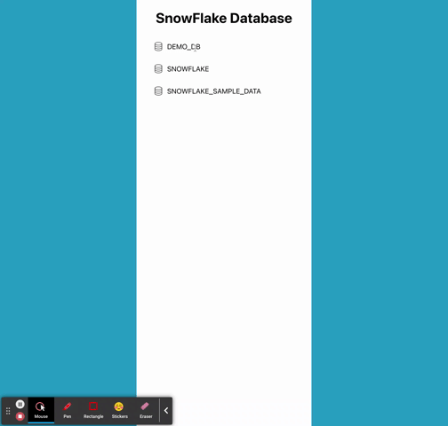
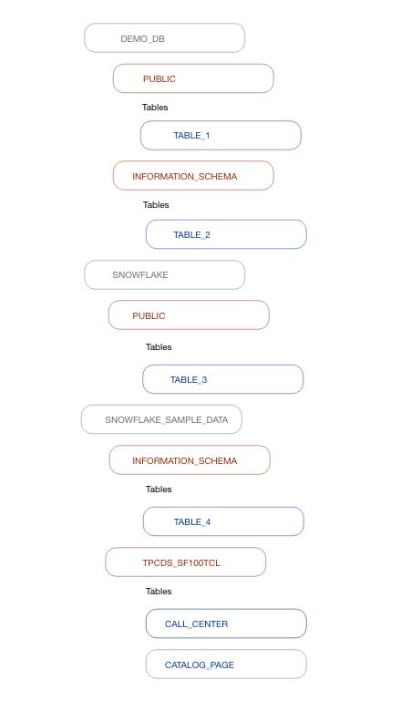

# SnowFlake Database

[Video](https://youtu.be/MZjx5rIQv18)

A database application where the user can click on the database to view schemas. The user can click on the schemas to view tables. The user can also close what they are viewing by clicking on the parent folder.



## Table of Contents

|                                         |                                         |                                             |
| :-------------------------------------: | :-------------------------------------: | :-----------------------------------------: |
|  [Introduction](#tsnowflake-database)   | [Table of Contents](#table-of-contents) | [Development Process](#development-process) |
|    [File Structure](#file-structure)    |        [Deployment](#deployment)        |    [Code Hightlights](#code-highlights)     |
| [Technologies Used](#Technologies-Used) |           [Credits](#Credits)           |             [License](#License)             |

## Development Process

1. Created a mockup of the UI on Adobe XD



2. Developed the UI skeleton

3. Add functionality

4. Adjusted the UI design.

5. Refactored code.

## File Structure

Each react component was under the components folder. A context folder was used to hold the context.

## Deployment

Here is the deployed [link](https://snowflake-db.vercel.app/).

The project was deployed using [Vercel](https://vercel.com/).

## Code Highlights

Use context to keep track off what database and schema are opened.

```JavaScript
const DatabaseContext = ({ children }) => {

    const [openDB, setOpenDB] = useState([])
    const [openSchema, setOpenSchema] = useState([])

    const data = [
        { name: 'TABLE_1', db_name: 'DEMO_DB', schema_name: 'PUBLIC', },
        { name: 'TABLE_2', db_name: 'DEMO_DB', schema_name: 'INFORMATION_SCHEMA', },
        { name: 'TABLE_3', db_name: 'SNOWFLAKE', schema_name: 'PUBLIC', },
        { name: 'TABLE_4', db_name: 'SNOWFLAKE_SAMPLE_DATA', schema_name: 'INFORMATION_SCHEMA', },
        { name: 'CALL_CENTER', db_name: 'SNOWFLAKE_SAMPLE_DATA', schema_name: 'TPCDS_SF100TCL', },
        { name: 'CATALOG_PAGE', db_name: 'SNOWFLAKE_SAMPLE_DATA', schema_name: 'TPCDS_SF100TCL', }
    ]

    return (
        <Database.Provider value={{ data, openDB, setOpenDB, openSchema, setOpenSchema }}>
            {children}
        </Database.Provider>
    )
}
```

Find the unique database to render on the main page.

```JavaScript
const DBContainer = () => {
  const { data, openDB } = DatabaseState();

  const uniqueDB = [...new Set(data.map((table) => table.db_name))];

  return (
    <div className={styles.nameContainer}>
      {uniqueDB.map((db, i) => {
        return <Name db={db} key={i} openDB={openDB} />;
      })}
    </div>
  );
};
```

## Technologies Used

- [React](https://reactjs.org/)

## Credits

|                           |                                                                                                                                                                                                       |
| ------------------------- | ----------------------------------------------------------------------------------------------------------------------------------------------------------------------------------------------------- |
| **David Anusontarangkul** | [ LinkedIn](https://www.linkedin.com/in/anusontarangkul/) [ GitHub](https://github.com/anusontarangkul) |

Icons were used from https://www.flaticon.com/.

## License

Copyright 2021

Permission is hereby granted, free of charge, to any person obtaining a copy of this software and associated documentation files (the "Software"), to deal in the Software without restriction, including without limitation the rights to use, copy, modify, merge, publish, distribute, sublicense, and/or sell copies of the Software, and to permit persons to whom the Software is furnished to do so, subject to the following conditions:

The above copyright notice and this permission notice shall be included in all copies or substantial portions of the Software.

THE SOFTWARE IS PROVIDED "AS IS", WITHOUT WARRANTY OF ANY KIND, EXPRESS OR IMPLIED, INCLUDING BUT NOT LIMITED TO THE WARRANTIES OF MERCHANTABILITY, FITNESS FOR A PARTICULAR PURPOSE AND NONINFRINGEMENT. IN NO EVENT SHALL THE AUTHORS OR COPYRIGHT HOLDERS BE LIABLE FOR ANY CLAIM, DAMAGES OR OTHER LIABILITY, WHETHER IN AN ACTION OF CONTRACT, TORT OR OTHERWISE, ARISING FROM, OUT OF OR IN CONNECTION WITH THE SOFTWARE OR THE USE OR OTHER DEALINGS IN THE SOFTWARE.
